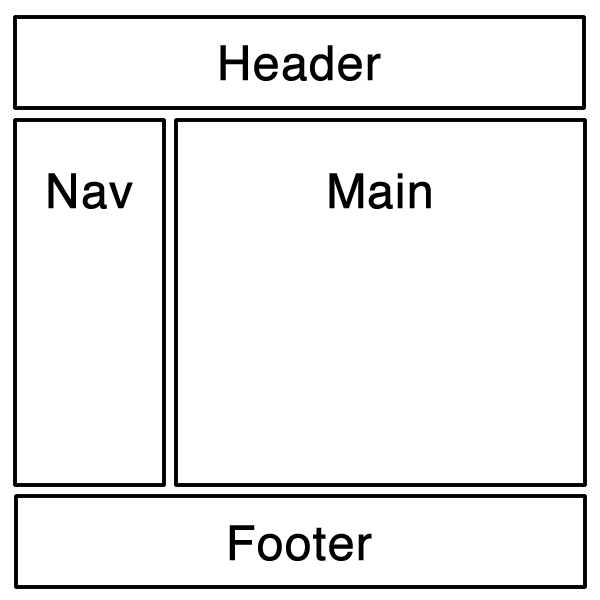

# Webpack 简介

## 写在开头
先说说为什么要写这篇文章, 最初的原因是组里的小朋友们看了webpack文档后, 表情都是这样的:
(摘自webpack[一篇文档](http://webpack.github.io/docs/usage.html)的评论区)


和这样的:


是的, 即使是英语国家的外国佬也在吐槽这文档不是人能看的. 回想起当年自己啃webpack文档的血与泪的往事,
觉得有必要整一个教程, 可以让大家看完后轻松愉快地搭建起一个webpack打包方案的项目.

可能会有人觉得我现在不用webpack活得也好好的, 没必要去搞这个东西. 所以, 在说webpack之前,
我想先谈一下前端打包方案这几年的演进历程, 在什么场景下, 我们遇到了什么问题, 催生出了应对这些问题的工具.
了解了需求和目的之后, 你就知道什么时候webpack可以帮到你.

## 先说说前端打包方案的黑暗历史
在很长的一段前端历史里, 是不存在打包这个说法的. 那个时候页面基本是纯静态的或者服务端输出的,
没有AJAX, 也没有jQuery. 那个时候的JavaScript就像个玩具, 用处大概就是在侧栏弄个时钟,
用media player放个mp3之类的脚本, 代码量不是很多, 直接放在`<script>`标签里或者弄个js文件引一下就行,
日子过得很轻松愉快.

随后的几年, 人们开始尝试在一个页面里做更多的事情. 容器的显示, 隐藏, 切换. 用css写的弹层,
图片轮播等等. 但如果一个页面内不能向服务器请求数据, 能做的事情毕竟有限的, 代码的量也能维持在页面交互逻辑范围内.
这时候很多人开始突破一个页面能做的事情的范围, 使用隐藏的iframe和flash等作为和服务器通信的桥梁,
新世界的大门慢慢地被打开, 在一个页面内和服务器进行数据交互, 意味着以前需要跳转多个页面的事情现在可以用一个页面搞定.
但由于iframe和flash技术过于tricky和复杂, 并没能得到广泛的推广.

直到Google推出Gmail的时候(2004年), 人们意识到了一个被忽略的接口, [XMLHttpRequest](https://developer.mozilla.org/en-US/docs/Web/API/XMLHttpRequest),
也就是我们俗称的AJAX, 这是一个使用方便的, 兼容性良好的服务器通信接口. 从此开始,
我们的页面开始玩出各种花来了, 前端一下子出现了各种各样的库, [Prototype](http://prototypejs.org/), [Dojo](https://dojotoolkit.org/), [MooTools](http://mootools.net/), [Ext JS](https://www.sencha.com/products/extjs/), [jQuery](https://jquery.com/)... 我们开始往页面里引用各种库和插件, 我们的js文件也就爆炸了...

随着js能做的事情越来越多, 引用越来越多, 文件越来越大, 加上当时大约只有2Mbps左右的网速, 下载速度还不如3G网络,
对js文件的压缩和合并的需求越来越强烈, 当然这里面也有把代码混淆了不容易被盗用等其他因素在里面. [JSMin](http://crockford.com/javascript/jsmin), [YUI Compressor](http://yui.github.io/yuicompressor/), [Closure Compiler](https://developers.google.com/closure/compiler/), [UglifyJS](http://lisperator.net/uglifyjs/) 等js文件压缩合并工具陆陆续续诞生了. 压缩工具是有了, 但我们得要执行它, 最简单的办法呢, 就是windows上搞个bat脚本,
mac/linux上搞个bash脚本, 哪几个文件要合并在一块的, 哪几个要压缩的, 发布的时候运行一下脚本,
生成压缩后的文件.

基于合并压缩技术, 项目越做越大, 问题也越来越多, 大概就是以下这些问题:
* 库和插件为了要给他人调用, 肯定要找个地方注册, 一般就是在window下申明一个全局的函数或对象.
  难保哪天用的两个库在全局用同样的名字, 那就冲突了.
* 库和插件如果还依赖其他的库和插件, 就要告知使用人, 需要先引哪些依赖库, 那些依赖库也有自己的依赖库的话,
  就要先引依赖库的依赖库, 以此类推...

恰好就在这个时候(2009年), 随着后端JavaScript技术的发展, 人们提出了[CommonJS](http://wiki.commonjs.org/wiki/Modules/1.1.1)
的模块化规范, 大概的语法是: 如果`a.js`依赖`b.js`和`c.js`, 那么就在`a.js`的头部, 引入这些依赖文件:
```js
var b = require('./b.js');
var c = require('./c.js');
```
那么变量`b`和`c`会是什么呢? 那就是`b.js`和`c.js`导出的东西, 比如`b.js`可以这样导出:
```js
exports.square = function(num) {
  return num * num;
};
```
然后就可以在`a.js`使用这个`square`方法:
```js
var n = b.square(2);
```
如果`c.js`想导出`Number`, 那么可以这样写:
```js
module.exports = 3.14159;
```
那么`a.js`中的变量`c`就是数字`3.14159`;
具体的语法规范可以查看Node.js的[文档](https://nodejs.org/dist/latest-v6.x/docs/api/modules.html).


但是CommonJS

于是呢, 就有人弄了个[AMD](http://requirejs.org/)模块方案解决了这个事情.

js的问题基本解决了, 但css和html也没闲着. 什么[less](http://lesscss.org/),
[sass](http://sass-lang.com/), [stylus](http://stylus-lang.com/)的css预处理器横空出世,
说能帮我们简化css的写法, 自动给你加vendor prefix. html在这期间也出现了一堆模板语言,
什么[handlebars](http://handlebarsjs.com/), [ejs](http://www.embeddedjs.com/),
[jade](http://jade-lang.com/), 可以把ajax拿到的数据插入到模板中, 然后用innerHTML显示到页面上.

托AMD和CSS预处理和模板语言的福, 我们的编译脚本也洋洋洒洒写了百来行, 又一个新需求就这样产生了:
我们需要一个简单的脚本文件, 可以利用各种编译工具, 编译/压缩js, css, html, 图片等资源.
然后[Grunt](http://gruntjs.com/)产生了, 配置文件格式是我们最爱的js, 比shell脚本熟悉很多,
写法也很简单, 社区有非常多的插件支持各种编译, lint, 测试工具. 一年多后另一个打包工具[gulp](http://gulpjs.com/)
诞生了, 扩展性更强, 采用流式处理效率更高.

依托AMD模块化编程, SPA(Single-page application)的概念顺其自然的出现了, 一个网页不再是传统的
类似word文档的页面, 而是一个完整的应用程序. SPA应用有一个总的入口页面, 我们通常把它命名为`index.html`,
`app.html`, `main.html`, 这个html的`<body>`一般是空的, 或者只有总的布局(layout), 比如下图:



布局会把header, nav, footer的内容填上, 但main区域是个空的容器. 这个作为入口的html最主要的工作
是加载启动SPA的js文件, 然后由js驱动, 加载对应的AMD模块, 然后该AMD模块执行, 渲染对应的html到页面指定的容器内(比如图中的main).
在点击链接等交互时, 页面不会跳转, 而是加载对应的AMD模块, 然后该AMD模块渲染对应的html到容器内.

虽然AMD模块让SPA得以实现, 但小问题还是很多的:
* 不是所有的第三方库都是AMD规范的, 这时候要配置`shim`, 很麻烦.
* 虽然RequireJS支持插件的形式通过把html作为依赖加载, 但html里面的``的路径是个问题,
  需要使用绝对路径并且保持打包后的图片路径和打包前的路径不变, 或者使用html模板语言把`src`写成变量,
  在运行时生成.
* 不支持动态加载css, 变通的方法是把所有的css文件合并压缩成一个文件, 在入口的html页面一次性加载.
* SPA项目越做越大, 一个应用打包后的js文件到了几MB的大小. 虽然`r.js`支持分模块打包, 但配置很麻烦,
  因为模块之间会互相依赖, 在配置的时候需要exclude那些通用的依赖项, 而依赖项要在文件里一个个检查.
* 所有的第三方库都要自己一个个的下载, 解压, 放到某个目录下, 更别提更新有多麻烦了.
  虽然可以用[npm](https://www.npmjs.com/)包管理工具, 但npm的包都是CommonJS规范的,
  给后端Node.js用的, 只有部分支持AMD规范, 而且在npm3.0之前, 这些包有依赖项的话也是不能用的.
  后来有个[bower](https://bower.io/)包管理工具是专门的web前端仓库, 这里的包一般都支持AMD规范.
* AMD规范定义和引用模块的语法太麻烦, 大家都喜欢CommonJS简洁的语法, 后来ES6模块规范也来插一脚,
  使引用模块加载.
* 项目的文件结构不合理, 因为grunt/gulp是按照文件格式批量处理的, 所以一般会把js, html, css, 图片
  分别放在不同的目录下, 所以同一个模块的文件会散落在不同的目录下, 开发的时候找文件是个麻烦的事情.
  code review时想知道一个文件是哪个模块的也很麻烦, 解决办法比如又要在imgs目录下建立按模块命名的文件夹,
  里面再放图片.


###
